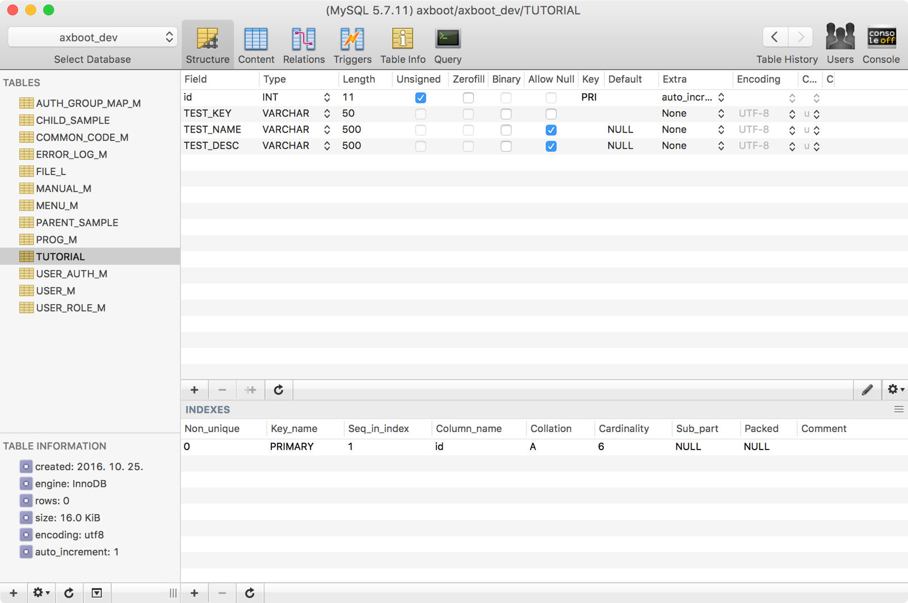
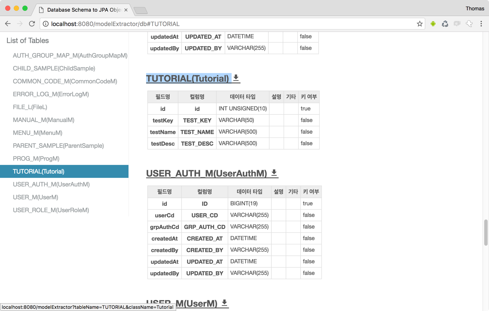
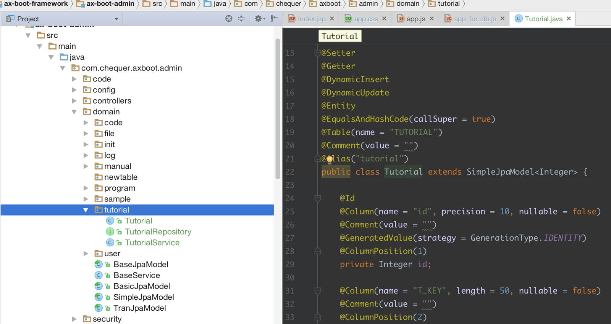
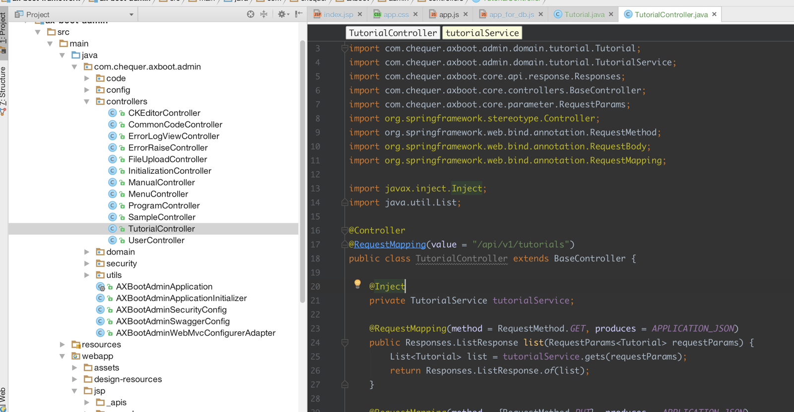
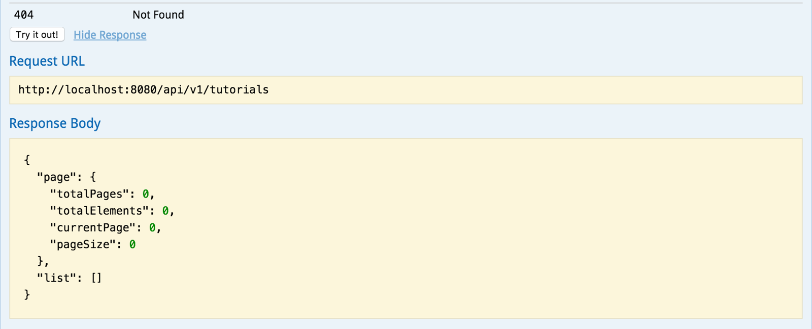

# ModelExtractor를 사용하여 역공학으로 AXBoot 클래스 생성하기

1. 클래스를 만들 대상 테이블이 아직 없다면, 새로운 테이블을 생성합니다.


2. http://{host}:{port}/modelExtractor/db 접속하여 클래스를 생성할 테이블을 선택합니다. 
예제에서는 TUTORIAL이라는 테이블을 신규로 생성했습니다. 

해당 테이블명을 선택하면 AXBoot에서 바로 사용할 수 있는 클래스가 새창에서 생성됩니다.

IDE에 붙여너


3. 클래스를 선택하면 새창으로 해당 테이블에 CRUD를 하기 위한 코드가 자동으로 생성되며, IDE에 조금더 쉽게 붙여넣기 할 수 있도록 바탕화면 -> output 디렉토리에도 자동으로 코드가 생성됩니다.
  - `Tutorial.java, TutorialRepository.java, TutorialService.java` 3개의 클래스파일을 
`ax-boot-admin/src/main/java/com/chequer/axboot/admin/domain` 도메인 패키지 하위에 새로운 패키지를 생성후 (예제에서는 tutorial 로 생성했습니다) 붙여넣기 합니다


  - `TutorialController.java` 컨트롤러 클래스를 `ax-boot-admin/src/main/java/com/chequer/axboot/admin/controllers` 컨트롤러 패키지에 붙여넣기 합니다.  컨트롤러 클래스를 열고 서비스와 엔티티를 임포트 합니다.
  - 도메인 패키지가 포함된 프로젝트에서 Maven Clean 골과 Compile골을 한번씩 실행합니다.
  - 톰캣을 재시작합니다.

4. http://localhost:8080/swagger/index.html 에서 API를 테스트 해봅니다.  `Try it out`버튼을 클릭하면 GET API 결과를 미리볼 수 있습니다.  
5. [PUT] /api/v1/tutorials에 다음과 같은 JSON을 입력하고 `Try it out` 버튼을 클릭하면 PUT 테스트를 진행할 수 있습니다.
```json
{
  "testKey": "TEST",
  "testName": "TEST NAME",
  "testDesc": "....."
}
```
이후 GET API를 호출하면 다음과 같이 저장한 데이터를 GET API를 통해 확인할 수 있습니다.
```json
{
  "page": {
    "totalPages": 0,
    "totalElements": 0,
    "currentPage": 0,
    "pageSize": 0
  },
  "list": [
    {
      "id": 7,
      "testKey": "TEST",
      "testName": "TEST NAME",
      "testDesc": ".....",
      "dataStatus": "ORIGIN",
      "__deleted__": false,
      "__created__": false,
      "__modified__": false
    }
  ]
}
```


